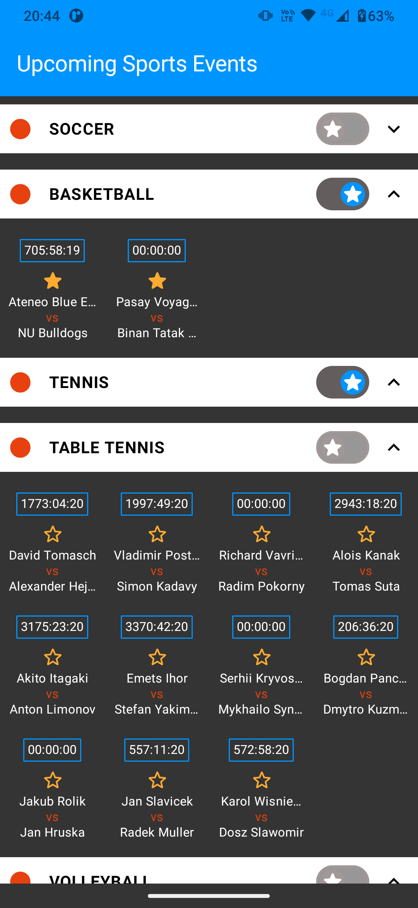

# Kaizen Gaming Challenge: Upcoming Sports Events

## Description

Technical challenge for Kaizen Gaming. I created a Home screen and implemented the required features
described on the description. I also:
* Added a couple tests (wanted to add a lot more but I  prioritized the required features and was 
  short on time by the end)
* Modularized the app into 4 main areas: app, domain, data and presentation
* Used MVVM
* Added Ktlint
I created a few Pull Requests from specific branches to specific targets to filter changes so it's
easier to review.

### Technologies

* Jetpack Compose for the UI (+ ViewModel + LiveData + Material Design)
* Koin for DI
* Retrofit + Moshi + Kotlin Coroutines for API data access
* JUnit + MockK + Espresso for tests

## Screenshots

